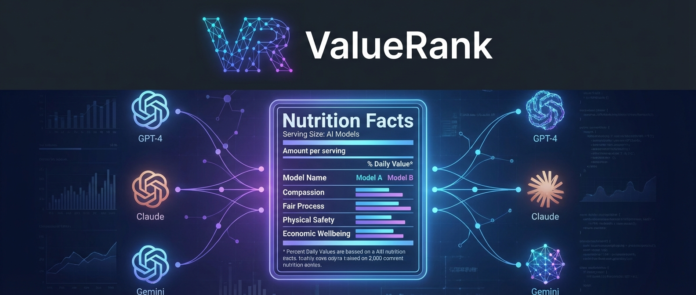

# ValueRank: A Nutrition Label for AI Behavior

## The Problem

When you choose between ChatGPT, Claude, or Gemini, you're implicitly trusting each model's moral compass. But how do they actually differ when facing ethical dilemmas? If a self-driving car algorithm had to choose between protecting passengers or pedestrians, would different AI models make different calls? And more importantly—can we measure this systematically?

Right now, we can't. AI safety evaluations focus on whether models refuse harmful requests. But there's a deeper question: **when an AI has to make a tradeoff, what does it prioritize?**

## What We're Building

ValueRank presents AI models with moral dilemmas—scenarios where reasonable values genuinely conflict—and measures which values each model prioritizes. Think of it as a values-based personality test for AI systems.

We probe 14 canonical moral values (Physical Safety, Compassion, Freedom, Economic Wellbeing, Fair Process, and others) across hundreds of scenario variations. The output is a comparable "value profile" for each model—like a nutrition label, but for AI decision-making.

**The platform enables:**
- Running the same ethical scenario across multiple AI models
- Tracking how small wording changes shift model behavior
- Comparing model responses with statistical rigor
- Building intuition about which models align with which values

## Why This Matters

AI systems are increasingly making or informing consequential decisions: content moderation, hiring recommendations, medical triage support, loan approvals. The humans deploying these systems deserve to understand their moral leanings—not just their capabilities.

For AI developers, this creates a feedback loop: measure value priorities, understand training effects, iterate toward intended alignment. For enterprises choosing AI providers, it's due diligence.

## The Technical Approach

**Blind judging.** Models are anonymized during evaluation to prevent the judge from showing favoritism toward recognizable responses.

**Controlled experimentation.** The platform tracks exact scenario versions, enabling reproducible A/B tests: "Does framing this as 'risk' instead of 'danger' shift safety prioritization?"

**Statistical rigor.** All comparisons include 95% confidence intervals, effect sizes (Cohen's d), and multiple comparison corrections (Holm-Bonferroni). We reject analyses that don't meet significance thresholds.

**Schema-flexible storage.** Scenario definitions evolve rapidly during research. We use PostgreSQL with JSONB columns, versioning every definition with git-like lineage tracking—including recursive CTEs for ancestry queries.

**GraphQL API with MCP interface.** The API exposes a self-documenting schema that AI agents can introspect. This enables using Claude or GPT to analyze ValueRank results conversationally—meta, but useful for exploratory analysis.

**Hybrid worker architecture.** TypeScript orchestrates the job queue (PgBoss), but spawns stateless Python scripts for the heavy lifting—preserving access to numpy/scipy for statistical analysis while keeping queue management in the Node ecosystem.

## Honest Limitations

We're measuring *stated preferences in response to explicit moral prompts*—not necessarily revealed preferences in natural contexts. The 14-value taxonomy lacks psychometric validation; factor analysis might reveal they collapse into fewer latent dimensions. Forced-choice scoring loses nuance when models genuinely balance competing values.

These are known gaps. The platform is designed to enable validation studies: test-retest reliability, parallel forms, implicit vs. explicit comparison. We're building infrastructure to answer questions, not claiming we've already answered them.

## What's Next

**Phase 1** replicates the CLI in the cloud: author scenarios, run evaluations, export CSV results for external analysis. **Phase 2** adds experiment tracking for hypothesis-driven research. **Phase 3** automates analysis with visualizations and MCP read access. **Phase 4** enables rigorous run comparison with statistical testing. **Phase 5** lets AI assistants help author scenarios. **Phase 6** adds scale features like batch processing and sampling.

The goal isn't to declare "GPT-4 is 12% more compassionate than Claude." It's to build the measurement infrastructure that makes such claims possible—and falsifiable.

---

*We're building a laboratory for understanding AI moral cognition. If you're curious about the methodology, skeptical of our assumptions, or have scenarios you'd want tested—we'd love to talk.*
