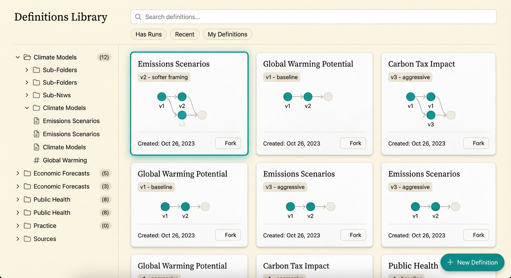
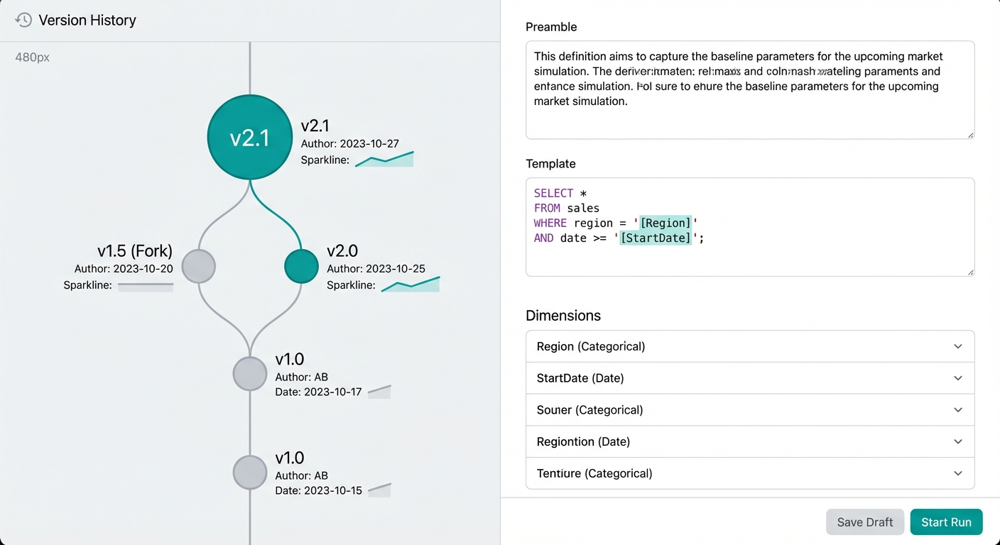
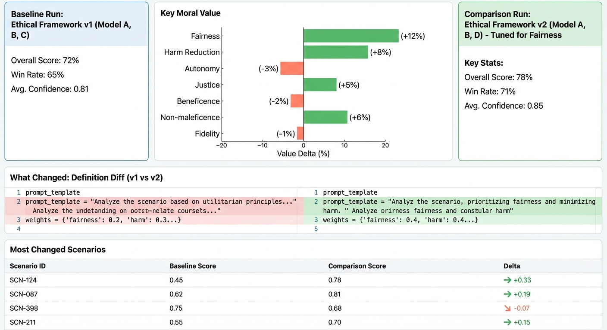
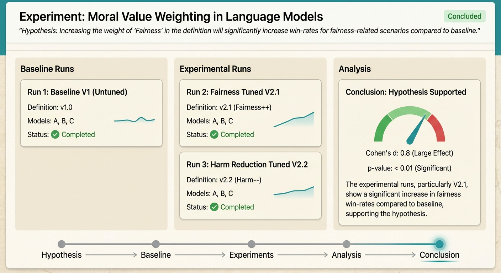
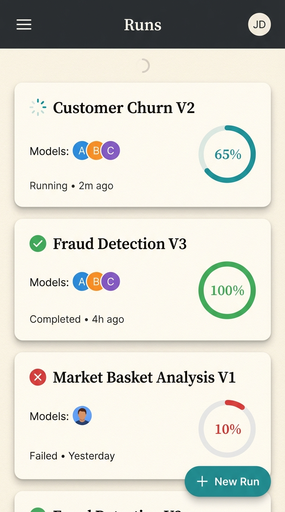

# Cloud ValueRank - UX Architecture

> Visual design specification for generating UX mockups
>
> Each section is designed to be sent independently to an image generation service (e.g., Nano Banana) for mockup creation.

---

## Design Philosophy

**Aesthetic Direction: "Research Observatory"**

A refined, data-forward interface that balances scientific rigor with approachable warmth. Think: a well-organized research lab meets a modern analytics dashboard. The UI respects that users are conducting serious scientific work while making complex data explorable and even enjoyable.

### Core Visual Principles

| Element | Approach |
|---------|----------|
| **Typography** | Instrument Serif for headings (editorial authority), JetBrains Mono for data/IDs, Source Sans 3 for body |
| **Color Palette** | Warm ivory background (#FDFBF7), deep charcoal text (#1A1A1A), accent teal (#0D9488) for actions, coral (#F97316) for alerts/highlights |
| **Data Visualization** | ColorBrewer categorical palette for model comparisons, consistent across all charts |
| **Layout** | Generous whitespace, card-based content grouping, left-aligned hierarchy |
| **Motion** | Subtle, purposeful - data loading shimmer, smooth panel transitions, no decorative animation |
| **Density** | High information density where needed (tables, charts), breathing room for navigation and controls |

### Signature Elements

1. **Version Lineage Lines** - Curved SVG connectors showing definition ancestry, rendered like a subway map
2. **Confidence Bands** - All statistics shown with visual confidence intervals (gradient fill bands)
3. **Model Avatars** - Small colored circles with first letter, consistent color per model across UI
4. **Progress Arcs** - Circular progress indicators for long-running operations
5. **Paper Texture** - Subtle noise overlay on card backgrounds suggesting physical documents

---

## Section 1: Global Shell & Navigation

**Mock Prompt:**
> Design a web application shell for a research analytics tool called "ValueRank". Dark charcoal header bar with the logo (stylized "VR" letters made of interconnected nodes, suggesting a value network). Main navigation as horizontal tabs in the header: "Definitions", "Runs", "Experiments", "Settings". The active tab has a teal underline accent. User avatar in top-right corner with initials. Below the header, the main content area has a warm ivory background. No sidebar - full-width content layout. Clean, editorial aesthetic with subtle academic undertones. Desktop viewport (1440px wide).


### Layout Structure

```
┌─────────────────────────────────────────────────────────────────────────┐
│  [VR Logo]   Definitions    Runs    Experiments    Settings     [👤 CA] │  ← Header (56px, #1A1A1A)
├─────────────────────────────────────────────────────────────────────────┤
│                                                                         │
│                                                                         │
│                      Main Content Area                                  │  ← Ivory (#FDFBF7)
│                      (Full width, scrollable)                           │
│                                                                         │
│                                                                         │
└─────────────────────────────────────────────────────────────────────────┘
```

### Navigation States

- **Default**: White text, 80% opacity
- **Hover**: White text, 100% opacity, subtle glow
- **Active**: White text, teal underline (3px), full opacity
- **Badge**: Small coral dot for notifications (e.g., "3 runs complete")

### Responsive Behavior

- **< 768px**: Navigation collapses to hamburger menu
- **768-1024px**: Condensed tab labels
- **> 1024px**: Full navigation with labels

---

## Section 2: Definitions Library

**Mock Prompt:**
> Design a "Definitions Library" page for a research tool. Left side (320px): a tree view showing scenario definition folders, expandable with chevrons. Each folder shows a count badge. Right side: a grid of definition cards. Each card shows: title in serif font, version label (e.g., "v2 - softer framing"), a small lineage diagram showing 2-3 connected nodes representing version history, creation date, and a "Fork" button. One card is selected with a teal border. A floating action button in bottom-right corner for "New Definition". Warm ivory background with white cards having subtle paper texture. Top of the page has a search bar with filter chips for "Has Runs", "Recent", "My Definitions".



### Page Layout

```
┌─────────────────────────────────────────────────────────────────────────┐
│  ┌─────────────────────────────────────────────────────────────────┐   │
│  │ 🔍 Search definitions...        [Has Runs] [Recent] [Mine]      │   │  ← Search/Filter Bar
│  └─────────────────────────────────────────────────────────────────┘   │
├─────────────────┬───────────────────────────────────────────────────────┤
│                 │                                                       │
│  📁 Safety      │   ┌─────────────┐  ┌─────────────┐  ┌─────────────┐  │
│    ├ café-v1    │   │ Café Safety │  │ Trolley-AV  │  │ Med Triage  │  │
│    └ café-v2 ●  │   │  Dilemma    │  │   Classic   │  │   Ethics    │  │
│  📁 Autonomy    │   │             │  │             │  │             │  │
│  📁 Economics   │   │ ○──○──●     │  │ ○──●        │  │ ●           │  │  ← Lineage mini-diagram
│                 │   │ v3 baseline │  │ v2 harsh    │  │ v1          │  │
│                 │   │ 3 days ago  │  │ 1 week ago  │  │ 2 weeks ago │  │
│  ─────────────  │   │   [Fork]    │  │   [Fork]    │  │   [Fork]    │  │
│  + New Folder   │   └─────────────┘  └─────────────┘  └─────────────┘  │
│                 │                                                       │
└─────────────────┴───────────────────────────────────────────────────────┘
                                                                    [+ New] ← FAB
```

### Definition Card Anatomy

- **Header**: Definition name (Instrument Serif, 16px, #1A1A1A)
- **Version Badge**: Pill with version label (JetBrains Mono, 11px, teal background)
- **Lineage Diagram**: 3-node max horizontal line with circles, active version filled
- **Meta**: Creation date, run count (Source Sans, 13px, #6B7280)
- **Action**: "Fork" ghost button, appears on hover
- **Selected State**: 2px teal border, subtle teal background tint

### Folder Tree

- Indentation: 16px per level
- Icons: Folder (open/closed state), Definition (wand icon in orange)
- Active indicator: Coral dot next to definitions with pending runs
- Count badge: Gray pill showing child count

---

## Section 3: Definition Editor (Version Tree View)

**Mock Prompt:**
> Design a split-view definition editor page. Left panel (480px): a vertical timeline/tree visualization showing version history. The tree flows top-to-bottom with nodes as circles connected by curved lines. Each node shows: version label, author initials, date, and a small sparkline of its run results. Branches fork visually when definitions were forked. The current version node is larger with a teal fill. Right panel: a form editor with sections for "Preamble" (large textarea), "Template" (syntax-highlighted textarea with [bracket] placeholders highlighted in teal), and "Dimensions" (accordion list of dimension definitions). A sticky bottom bar shows "Save Draft" and "Start Run" buttons.



### Layout Structure

```
┌──────────────────────────────────────────────────────────────────────────┐
│  ← Back to Library          Café Safety Dilemma              [⋮ Actions] │  ← Breadcrumb header
├────────────────────────┬─────────────────────────────────────────────────┤
│                        │                                                 │
│   VERSION HISTORY      │   DEFINITION CONTENT                            │
│                        │                                                 │
│      ○ v1 (root)       │   ┌─────────────────────────────────────────┐  │
│      │  JD · Jan 5     │   │ Preamble                            [?] │  │
│      │  ▁▂▃▂▁          │   │                                         │  │
│      │                 │   │ You are being asked to reason about     │  │
│      ├─○ v2 (harsh)    │   │ a moral dilemma involving...            │  │
│      │   CA · Jan 12   │   └─────────────────────────────────────────┘  │
│      │   ▂▅▇▅▃         │                                                 │
│      │                 │   ┌─────────────────────────────────────────┐  │
│      └─● v3 (current)  │   │ Template                            [?] │  │
│          CA · Jan 15   │   │                                         │  │
│          ▃▄▅▆▇ ←active │   │ A café owner notices [situation] where │  │
│                        │   │ [severity] puts customers at risk...    │  │
│                        │   └─────────────────────────────────────────┘  │
│   [Compare Versions]   │                                                 │
│                        │   ┌─────────────────────────────────────────┐  │
│                        │   │ Dimensions                          [+] │  │
│                        │   ├─────────────────────────────────────────┤  │
│                        │   │ ▼ situation (4 levels)                  │  │
│                        │   │ ▶ severity (3 levels)                   │  │
│                        │   │ ▶ actor_type (2 levels)                 │  │
│                        │   └─────────────────────────────────────────┘  │
│                        │                                                 │
├────────────────────────┴─────────────────────────────────────────────────┤
│        [Save Draft]                              [Preview] [▶ Start Run] │  ← Sticky footer
└──────────────────────────────────────────────────────────────────────────┘
```

### Version Tree Nodes

- **Circle Size**: Root and current = 14px, others = 10px
- **Colors**: Current = teal fill, ancestors = gray stroke, siblings = light gray
- **Connector Lines**: Curved bezier paths, 2px stroke, dashed for uncommitted changes
- **Sparkline**: 5-bar mini chart showing run result trend (gray bars, teal for best)
- **Hover State**: Node expands slightly, shows tooltip with full details

### Template Syntax Highlighting

- **Placeholders**: `[dimension_name]` highlighted with teal background, rounded corners
- **Line Numbers**: Gray monospace on left gutter
- **Error State**: Red underline with tooltip for invalid placeholders

---

## Section 4: Run Dashboard

**Mock Prompt:**
> Design a "Runs" dashboard page for a research analytics tool. A table view showing evaluation runs with columns: Status (icon + label), Definition (linked name), Models (stack of small colored circles representing each AI model), Progress (circular arc indicator showing percentage), Created (relative time), Duration. Status types: "Running" (animated spinner, teal), "Completed" (checkmark, green), "Failed" (X, coral), "Queued" (clock, gray). Rows are grouped by date ("Today", "Yesterday", "This Week"). Above the table: filter pills for status types, and a prominent "New Run" button. Include an expandable row detail showing individual model progress when clicked.


### Table Layout

```
┌──────────────────────────────────────────────────────────────────────────┐
│  Runs                                                                     │
│                                                                           │
│  [All] [⏳ Queued (3)] [▶ Running (1)] [✓ Completed] [✗ Failed]   [+ New Run] │
├──────────────────────────────────────────────────────────────────────────┤
│  TODAY                                                                    │
├──────────────────────────────────────────────────────────────────────────┤
│  ▶ Running    │ Café Safety v3     │ ●●●○  │ ◔ 67%  │ 5 min ago │ 12m    │
│  ├────────────┴──────────────────────────────────────────────────────────┤
│  │  gpt-4o      ████████████░░░░  45/50 ✓                                │  ← Expanded detail
│  │  claude-3    █████████░░░░░░░  32/50 ⏳                                │
│  │  gemini-pro  ████████████████  50/50 ✓                                │
│  │  llama-3     ░░░░░░░░░░░░░░░░   0/50 ⏸                                │
│  └───────────────────────────────────────────────────────────────────────┤
│  ✓ Completed  │ Trolley AV v2      │ ●●    │ ✓ 100% │ 2 hrs ago │ 45m    │
│  ✓ Completed  │ Medical Triage     │ ●●●   │ ✓ 100% │ 3 hrs ago │ 1h 12m │
├──────────────────────────────────────────────────────────────────────────┤
│  YESTERDAY                                                               │
├──────────────────────────────────────────────────────────────────────────┤
│  ✗ Failed     │ Economics v1       │ ●●    │ ✗ 23%  │ Yesterday │ 8m     │
│  ✓ Completed  │ Café Safety v2     │ ●●●●  │ ✓ 100% │ Yesterday │ 2h 5m  │
└──────────────────────────────────────────────────────────────────────────┘
```

### Status Indicators

| Status | Icon | Color | Animation |
|--------|------|-------|-----------|
| Queued | Clock | Gray (#9CA3AF) | None |
| Running | Spinner | Teal (#0D9488) | Rotation |
| Completed | Checkmark | Green (#10B981) | None |
| Failed | X | Coral (#F97316) | None |
| Paused | Pause bars | Yellow (#F59E0B) | None |

### Progress Arc

- **Circular indicator**: 32px diameter, 3px stroke
- **Background**: Light gray track
- **Fill**: Teal arc proportional to completion
- **Center text**: Percentage in JetBrains Mono, 11px

### Model Stack

- **Circles**: 16px diameter, stacked with 4px overlap
- **Colors**: Consistent per model (GPT = green, Claude = orange, Gemini = blue, etc.)
- **Max visible**: 4, then "+N" overflow indicator
- **Hover**: Tooltip listing all models

---

## Section 5: Results Analysis View

**Mock Prompt:**
> Design a results analysis page for an AI evaluation tool. Header shows run metadata: definition name, models tested, total scenarios, completion time. Below, a tab bar with analysis views: "Summary", "Model Comparison", "Scenario Breakdown", "Dimension Analysis". The Summary tab is active, showing: 1) A horizontal bar chart of 14 moral values with win-rates per model (color-coded bars with confidence interval whiskers), 2) A key insights panel with auto-generated bullet points highlighted with lightbulb icons, 3) A "Most Contested Scenarios" mini-table showing top 5 scenarios where models disagreed most. Clean data visualization with ColorBrewer palette. Charts have subtle grid lines and clear axis labels.


### Page Layout

```
┌──────────────────────────────────────────────────────────────────────────┐
│  ← Back to Runs                                                          │
│                                                                          │
│  Café Safety Dilemma v3                                                  │
│  ●●●● gpt-4o, claude-3, gemini-pro, llama-3   ·   50 scenarios  ·  45m   │
│                                                                          │
│  [Summary] [Model Comparison] [Scenario Breakdown] [Dimension Analysis]  │
├──────────────────────────────────────────────────────────────────────────┤
│                                                                          │
│  VALUE WIN RATES                                          KEY INSIGHTS   │
│  ─────────────────────────────────────────────────        ────────────   │
│                                                           │              │
│  Physical_Safety   ●━━━━━━━━━━━━━━━━━│━━━━━━━  72%       │ 💡 Claude    │
│                    ○━━━━━━━━━━━━━│━━━━━━━━━━━━  68%       │ prioritizes  │
│                    ◆━━━━━━━━━━│━━━━━━━━━━━━━━━  65%       │ safety 12%   │
│                    □━━━━━━━━━━━━━━━━━━│━━━━━━━  71%       │ more than    │
│                                                           │ GPT-4o       │
│  Compassion        ●━━━━━━━━━━━━━━━│━━━━━━━━━━  58%       │              │
│                    ○━━━━━━━━━━│━━━━━━━━━━━━━━━  45%       │ 💡 Gemini    │
│                    ◆━━━━━━━━━━━━━━━━━━│━━━━━━━  62%       │ shows high   │
│                    □━━━━━━━━━━━━━│━━━━━━━━━━━━  52%       │ variance on  │
│  ...                                                      │ Economics    │
│                                                                          │
│  ● gpt-4o  ○ claude-3  ◆ gemini-pro  □ llama-3           │ [View All]   │
│                                                           │              │
├──────────────────────────────────────────────────────────┴──────────────┤
│                                                                          │
│  MOST CONTESTED SCENARIOS                                                │
│  ─────────────────────────                                               │
│  Scenario                          Variance    Models Disagreed          │
│  café_severe_stranger_v3           0.45        claude-3 ↔ gpt-4o        │
│  café_minor_regular_v2             0.38        gemini ↔ llama-3          │
│  café_moderate_employee_v1         0.31        gpt-4o ↔ llama-3          │
│                                                        [View All →]      │
└──────────────────────────────────────────────────────────────────────────┘
```

### Value Bar Chart

- **Bar**: Horizontal, grouped by value (one row per value, bars per model)
- **Whiskers**: Thin lines showing 95% CI extending from bar end
- **Model Legend**: Colored shapes (circle, diamond, square) matching model identity
- **Grid**: Light gray horizontal lines at 25%, 50%, 75%, 100%
- **Hover**: Tooltip shows exact percentage, CI bounds, sample size

### Insights Panel

- **Icon**: Lightbulb in teal (#0D9488)
- **Text**: Short insight sentence (Source Sans, 14px)
- **Background**: Light teal tint (#F0FDFA)
- **Max visible**: 3 insights, "View All" link for more

---

## Section 6: Run Comparison View

**Mock Prompt:**
> Design a side-by-side run comparison page for evaluating AI moral behavior. Split view with "Baseline" run on left and "Comparison" run on right, each showing the run name and key stats. In the center, a delta visualization: a diverging bar chart showing which values shifted between runs (bars extending left for decreases, right for increases). Below, a "What Changed" panel showing the diff between the two definitions (like a code diff with green/red highlighting). At the bottom, a table of "Most Changed Scenarios" with columns for scenario ID, baseline score, comparison score, and delta (with color coding: green for positive change, coral for negative).





### Layout Structure

```
┌──────────────────────────────────────────────────────────────────────────┐
│  ← Back to Experiments          Compare Runs                     [Export]│
├────────────────────────┬─────────────────────┬───────────────────────────┤
│                        │                     │                           │
│  BASELINE              │      DELTA          │  COMPARISON               │
│  ────────              │      ─────          │  ──────────               │
│                        │                     │                           │
│  Café Safety v2        │                     │  Café Safety v3           │
│  Run: run_a1b2c3       │                     │  Run: run_d4e5f6          │
│  Yesterday · 45m       │                     │  Today · 42m              │
│                        │                     │                           │
│  Models: ●●●           │ Physical   ◀━━━━━━━│━━━▶   +4.2%               │
│  Scenarios: 50         │ Safety                    │  Models: ●●●        │
│  Avg Score: 0.68       │                           │  Scenarios: 50      │
│                        │ Compassion     ◀━━━│━━━━━▶  +8.1%              │
│                        │                           │  Avg Score: 0.72    │
│                        │ Economics  ━━━━▶│◀        -3.5%                │
│                        │                     │                           │
├────────────────────────┴─────────────────────┴───────────────────────────┤
│                                                                          │
│  WHAT CHANGED                                                            │
│  ─────────────                                                           │
│  ┌────────────────────────────────────────────────────────────────────┐ │
│  │  - "danger" was changed to "risk" in template                      │ │  ← Red highlight
│  │  + Added new severity level: "catastrophic"                        │ │  ← Green highlight
│  │  ~ Modified 2 dimension options                                    │ │  ← Yellow highlight
│  └────────────────────────────────────────────────────────────────────┘ │
│                                                                          │
│  MOST CHANGED SCENARIOS                                                  │
│  ─────────────────────                                                   │
│  Scenario                    Baseline    Comparison    Delta             │
│  café_severe_stranger        0.45        0.72          +0.27 ▲          │  ← Green
│  café_minor_regular          0.81        0.65          -0.16 ▼          │  ← Coral
│  café_moderate_employee      0.62        0.68          +0.06 ▲          │
│                                                              [View All]  │
└──────────────────────────────────────────────────────────────────────────┘
```

### Diverging Delta Chart

- **Center axis**: Vertical line at 0% change
- **Left bars**: Coral/red for negative change, pointing left
- **Right bars**: Teal/green for positive change, pointing right
- **Value labels**: Percentage at bar end with +/- sign
- **Significance indicator**: * for p < 0.05, ** for p < 0.01

### Change Indicators

- **Increase**: Teal text, ▲ arrow, green background tint
- **Decrease**: Coral text, ▼ arrow, red background tint
- **No change**: Gray text, dash

---

## Section 7: Experiment Workspace

**Mock Prompt:**
> Design an "Experiment" workspace page for scientific hypothesis testing. Header shows experiment name, hypothesis statement in italics, and status badge ("Running", "Concluded"). Below, a Kanban-style layout with three columns: "Baseline Runs" (1 card), "Experimental Runs" (2-3 cards), and "Analysis" (comparison results). Each run card shows: run name, definition version, models used, status, and a mini result sparkline. The Analysis column shows a conclusion card with effect size visualization (Cohen's d shown as a gauge), p-value, and a natural language conclusion. A timeline at the bottom shows experiment progression: "Hypothesis → Baseline → Experiments → Analysis → Conclusion". Current stage is highlighted.




### Layout Structure

```
┌──────────────────────────────────────────────────────────────────────────┐
│  ← Back to Experiments                                                   │
│                                                                          │
│  Does softer framing increase safety prioritization?            [Running]│
│  ──────────────────────────────────────────────────────────────          │
│  Hypothesis: "Changing 'danger' to 'risk' will increase Physical_Safety  │
│              win-rate by at least 5% across all models"                  │
│                                                                          │
│  Controlled: Models (gpt-4o, claude-3), Scenario count (50)              │
│  Variable: Template language (danger → risk)                             │
├──────────────────────────────────────────────────────────────────────────┤
│                                                                          │
│  BASELINE              EXPERIMENTAL            ANALYSIS                  │
│  ────────              ────────────            ────────                  │
│                                                                          │
│  ┌────────────────┐   ┌────────────────┐     ┌─────────────────────────┐│
│  │ Café v2        │   │ Café v3-soft   │     │ EFFECT SIZE             ││
│  │ "danger"       │   │ "risk"         │     │                         ││
│  │ ●● 2 models    │   │ ●● 2 models    │     │    ◐ d = 0.42          ││
│  │ ✓ Complete     │   │ ✓ Complete     │     │    ▔▔▔▔▔●▔▔▔▔▔         ││
│  │ ▃▄▅▆▅ 0.68     │   │ ▄▅▆▇▆ 0.72     │     │    small  med  large   ││
│  │                │   │                │     │                         ││
│  │ [View Results] │   │ [View Results] │     │ p-value: 0.023 *        ││
│  └────────────────┘   └────────────────┘     │ CI: [+2.1%, +6.8%]      ││
│                                              │                         ││
│                       ┌────────────────┐     │ ─────────────────────── ││
│                       │ Café v3-gentle │     │ Conclusion: SUPPORTED   ││
│                       │ "concern"      │     │                         ││
│                       │ ●● 2 models    │     │ Softer language shows   ││
│                       │ ▶ Running 45%  │     │ statistically significant││
│                       │ ░░░░░░░░░░░░░░ │     │ increase in safety      ││
│                       │                │     │ prioritization (medium  ││
│                       │ [View Progress]│     │ effect size)            ││
│                       └────────────────┘     └─────────────────────────┘│
│                                                                          │
├──────────────────────────────────────────────────────────────────────────┤
│  ○─────────○─────────●─────────○─────────○                              │
│  Hypothesis  Baseline  Experiments  Analysis  Conclusion                 │  ← Timeline
└──────────────────────────────────────────────────────────────────────────┘
```

### Run Cards

- **Header**: Definition name + variant label
- **Model stack**: Colored circles
- **Status**: Icon + label (same as Run Dashboard)
- **Sparkline**: 5-bar mini chart of results
- **Score**: Average value score in JetBrains Mono
- **Action**: "View Results" or "View Progress" link

### Effect Size Gauge

- **Scale**: Linear from 0 to 1.0 (Cohen's d)
- **Zones**: Small (0-0.2), Medium (0.2-0.5), Large (0.5+)
- **Marker**: Filled circle on scale
- **Zone colors**: Gray → Teal → Green gradient

### Experiment Timeline

- **Nodes**: Circles connected by lines
- **States**: Empty (pending), Filled (current), Checked (complete)
- **Labels**: Stage names below nodes
- **Current highlight**: Larger node with teal fill

---

## Section 8: Empty & Loading States

**Mock Prompt:**
> Design a collection of empty and loading states for a research analytics tool. Include: 1) Empty definitions library with illustration of a document with a plus sign, text "No definitions yet" and a "Create your first definition" CTA button. 2) Loading state with a subtle shimmer animation on placeholder cards (skeleton UI). 3) No results state for search with illustration of a magnifying glass, text "No matches found". 4) Error state with warning icon, "Something went wrong" message and "Retry" button. Use the warm ivory background and maintain the editorial aesthetic. Illustrations should be simple line drawings in teal.


### Empty States

```
┌─────────────────────────────────────────────────────────────────┐
│                                                                 │
│                          ┌─────────┐                            │
│                          │  📄 +   │  ← Simple line illustration │
│                          └─────────┘                            │
│                                                                 │
│                    No definitions yet                           │  ← Instrument Serif, 24px
│                                                                 │
│          Start by creating your first scenario definition       │  ← Source Sans, 14px, gray
│                                                                 │
│                   [Create Definition →]                         │  ← Teal button
│                                                                 │
└─────────────────────────────────────────────────────────────────┘
```

### Loading Skeleton

- **Card shape**: Rounded rectangle matching actual card dimensions
- **Animation**: Shimmer gradient moving left-to-right (CSS animation)
- **Color**: Light gray (#E5E7EB) to white (#F9FAFB) gradient
- **Duration**: 1.5s per cycle, infinite loop

### Error State

- **Icon**: Warning triangle in coral
- **Heading**: "Something went wrong"
- **Body**: Specific error message if available
- **Action**: "Retry" button (outlined coral style)

---

## Section 9: Mobile Responsive View (Run Dashboard)

**Mock Prompt:**
> Design the mobile view (375px width) of the Run Dashboard for a research analytics tool. The navigation is collapsed into a hamburger menu icon in the header. The runs are displayed as a card stack instead of a table, with each card showing: status icon, definition name (bold), model avatars, progress arc, and relative time. Cards have rounded corners and subtle shadow. Include a floating action button in bottom-right for "New Run". Pull-to-refresh indicator at top. Maintain the warm ivory background and editorial typography.




### Mobile Card Layout

```
┌─────────────────────────┐
│  [≡] ValueRank      [●] │  ← Collapsed nav
├─────────────────────────┤
│                         │
│  ↓ Pull to refresh      │
│                         │
│  ┌─────────────────────┐│
│  │ ▶ Running           ││
│  │                     ││
│  │ Café Safety v3      ││  ← Bold, Instrument Serif
│  │ ●●●○  4 models      ││
│  │                     ││
│  │   ◔ 67%      5m ago ││
│  └─────────────────────┘│
│                         │
│  ┌─────────────────────┐│
│  │ ✓ Completed         ││
│  │                     ││
│  │ Trolley AV v2       ││
│  │ ●●  2 models        ││
│  │                     ││
│  │   ✓ 100%    2h ago  ││
│  └─────────────────────┘│
│                         │
│  ┌─────────────────────┐│
│  │ ✗ Failed            ││
│  │                     ││
│  │ Economics v1        ││
│  │ ●●  2 models        ││
│  │                     ││
│  │   ✗ 23%   Yesterday ││
│  └─────────────────────┘│
│                         │
│                    [+]  │  ← FAB
└─────────────────────────┘
```

### Mobile Considerations

- **Touch targets**: Minimum 44px for interactive elements
- **Card spacing**: 12px vertical gap
- **Swipe actions**: Swipe left to reveal "Cancel" / "Delete" options
- **Status bar**: Native status bar color matching header (#1A1A1A)

---

## Component Library Reference

### Typography Scale

| Element | Font | Size | Weight | Color |
|---------|------|------|--------|-------|
| H1 (Page title) | Instrument Serif | 28px | 500 | #1A1A1A |
| H2 (Section) | Instrument Serif | 20px | 500 | #1A1A1A |
| H3 (Card title) | Instrument Serif | 16px | 500 | #1A1A1A |
| Body | Source Sans 3 | 14px | 400 | #374151 |
| Caption | Source Sans 3 | 12px | 400 | #6B7280 |
| Mono (data/IDs) | JetBrains Mono | 12px | 400 | #1A1A1A |
| Code | JetBrains Mono | 13px | 400 | #1A1A1A |

### Color Tokens

```css
:root {
  /* Backgrounds */
  --bg-primary: #FDFBF7;      /* Warm ivory */
  --bg-secondary: #FFFFFF;    /* Cards */
  --bg-elevated: #FFFFFF;     /* Modals */

  /* Text */
  --text-primary: #1A1A1A;    /* Headings */
  --text-secondary: #374151;  /* Body */
  --text-muted: #6B7280;      /* Captions */
  --text-disabled: #9CA3AF;

  /* Accents */
  --accent-primary: #0D9488;  /* Teal - actions, active states */
  --accent-secondary: #F97316; /* Coral - alerts, highlights */
  --accent-success: #10B981;  /* Green - success states */
  --accent-warning: #F59E0B;  /* Yellow - warnings */

  /* Borders */
  --border-default: #E5E7EB;
  --border-focus: #0D9488;

  /* Model Colors (consistent throughout) */
  --model-gpt: #10B981;       /* Green */
  --model-claude: #F97316;    /* Orange */
  --model-gemini: #3B82F6;    /* Blue */
  --model-llama: #8B5CF6;     /* Purple */
  --model-mistral: #EC4899;   /* Pink */
}
```

### Button Styles

| Type | Background | Border | Text | Use Case |
|------|------------|--------|------|----------|
| Primary | Teal (#0D9488) | None | White | Main actions |
| Secondary | White | 1px Gray | Gray | Secondary actions |
| Ghost | Transparent | None | Teal | Tertiary actions |
| Danger | Coral (#F97316) | None | White | Destructive actions |

### Card Styles

- **Border radius**: 8px
- **Shadow**: `0 1px 3px rgba(0,0,0,0.1)`
- **Hover shadow**: `0 4px 6px rgba(0,0,0,0.1)`
- **Border**: 1px solid #E5E7EB
- **Selected border**: 2px solid #0D9488
- **Padding**: 16px (desktop), 12px (mobile)

---

## Implementation Notes

### Font Loading

```html
<link rel="preconnect" href="https://fonts.googleapis.com">
<link href="https://fonts.googleapis.com/css2?family=Instrument+Serif:wght@400;500&family=JetBrains+Mono:wght@400;500&family=Source+Sans+3:wght@400;500;600&display=swap" rel="stylesheet">
```

### Animation Guidelines

- **Duration**: 150ms for micro-interactions, 300ms for transitions
- **Easing**: `ease-out` for enters, `ease-in` for exits
- **Shimmer**: Linear gradient animation, 1.5s infinite
- **Progress arcs**: CSS `stroke-dasharray` animation

### Accessibility

- **Focus rings**: 2px solid teal, 2px offset
- **Color contrast**: All text passes WCAG AA
- **Reduced motion**: Respect `prefers-reduced-motion`
- **Screen reader**: ARIA labels on all interactive elements

---

## Mock Generation Checklist

When sending sections to image generation:

1. [ ] Include the **Mock Prompt** verbatim
2. [ ] Specify viewport: Desktop (1440px) or Mobile (375px)
3. [ ] Mention aesthetic keywords: "editorial", "research tool", "warm ivory", "teal accents"
4. [ ] Request specific fonts: Instrument Serif, JetBrains Mono, Source Sans
5. [ ] Note: Avoid generic "SaaS dashboard" aesthetics
