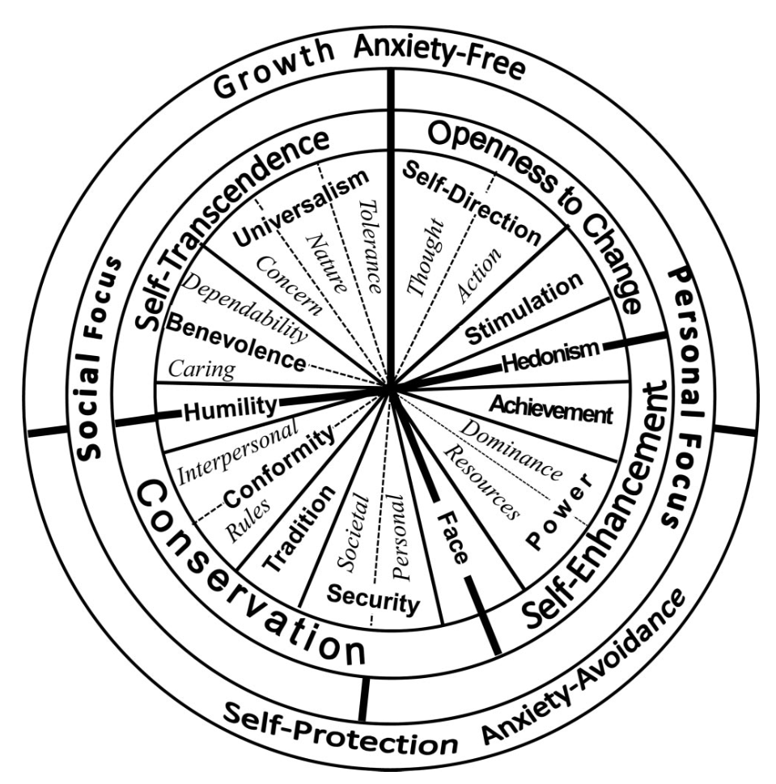

# The 19 Refined Schwartz Values

> **Source**: Schwartz, S.H., Cieciuch, J., Vecchione, M., Davidov, E., Fischer, R., Beierlein, C., Ramos, A., Verkasalo, M., Lönnqvist, J.-E., Demirutku, K., Dirilen-Gumus, O., & Konty, M. (2012). Refining the theory of basic individual values. *Journal of Personality and Social Psychology*, 103(4), 663–688.
>
> **DOI**: [10.1037/a0029393](https://doi.org/10.1037/a0029393)
> **PubMed**: [22823292](https://pubmed.ncbi.nlm.nih.gov/22823292/)
> **APA PsycNet**: [2012-19404-001](https://psycnet.apa.org/record/2012-19404-001)
> **Semantic Scholar**: [Full Paper](https://www.semanticscholar.org/paper/Refining-the-theory-of-basic-individual-values.-Schwartz-Cieciuch/b3789257600b4dfe24fdcc9895629705e84ba8d7)

---

## Overview

This document presents the canonical list of the 19 refined Schwartz values, written to be implementation-ready for ValueRank: descriptive, not philosophical, and easy to translate to public language later.

**Important context:**

- This is the most expanded, peer-reviewed version of Schwartz's value theory
- Values are grouped by four higher-order families so the conflict structure stays visible
- These value labels are not how the public typically thinks about values—translation will be needed for user-facing outputs
- Anything more granular than these 19 values is no longer a *value*—it becomes a **domain** (e.g., animals, children), a **rule** (e.g., rights as trumps), or a **framing** (e.g., fairness vs efficiency)

---

## Openness to Change

Values emphasizing readiness for new ideas, actions, and experiences. Conflicts with **Conservation** values.

### 1. Self-Direction – Thought

> *"Freedom to cultivate one's own ideas and abilities"* (Schwartz et al., 2012, Table 2)

- Valuing independent thinking and forming one's own opinions
- Emphasis on intellectual autonomy and freedom of belief
- Resistance to enforced ideology or dogma

**Example**: Supporting the right to hold unpopular political or religious views

### 2. Self-Direction – Action

> *"Freedom to determine one's own actions"* (Schwartz et al., 2012, Table 2)

- Valuing freedom to choose one's own actions and life path
- Emphasis on personal agency and self-authorship
- Opposition to coercion or unnecessary restriction

**Example**: Letting someone choose their career even if others disapprove

### 3. Stimulation

> *"Excitement, novelty, and change"* (Schwartz et al., 2012, Table 2)

- Seeking novelty, excitement, and challenge
- Preference for change over routine
- Comfort with risk and uncertainty

**Example**: Supporting experimental urban design over preserving the status quo

### 4. Hedonism

> *"Pleasure and sensuous gratification"* (Schwartz et al., 2012, Table 2)

- Valuing pleasure, enjoyment, and sensory gratification
- Desire for comfort and immediate well-being
- Often conflicts with restraint or duty

**Example**: Prioritizing leisure and enjoyment over long-term sacrifice

*Note: Hedonism sits on the border between Openness to Change and Self-Enhancement (Schwartz et al., 2012, p. 669).*

---

## Self-Enhancement

Values emphasizing pursuit of one's own interests and success. Conflicts with **Self-Transcendence** values.

### 5. Achievement

> *"Success according to social standards"* (Schwartz et al., 2012, Table 2)

- Valuing success and competence by social standards
- Desire to demonstrate ability and effectiveness
- Emphasis on performance, excellence, and results

**Example**: Supporting policies that reward merit and high performance

### 6. Power – Dominance

> *"Power through exercising control over people"* (Schwartz et al., 2012, Table 2)

- Valuing control over people and social hierarchies
- Acceptance of authority, command, and subordination
- Comfort with unequal power relationships

**Example**: Defending strong executive authority to maintain order

### 7. Power – Resources

> *"Power through control of material and social resources"* (Schwartz et al., 2012, Table 2)

- Valuing control over material, economic, or strategic resources
- Focus on capacity, leverage, and influence
- Often framed as competitiveness or strength

**Example**: Supporting national control over critical infrastructure

### 8. Face

> *"Security and power through maintaining one's public image and avoiding humiliation"* (Schwartz et al., 2012, Table 2)

- Valuing social image, reputation, and avoiding humiliation
- Sensitivity to shame, respect, and public standing
- Desire to maintain dignity in others' eyes

**Example**: Avoiding public apologies that might signal weakness

*Note: Face sits on the border between Self-Enhancement (Power) and Conservation (Security) (Schwartz et al., 2012, p. 669–670).*

---

## Conservation

Values emphasizing self-restriction, order, and resistance to change. Conflicts with **Openness to Change** values.

### 9. Security – Personal

> *"Safety in one's immediate environment"* (Schwartz et al., 2012, Table 2)

- Valuing personal safety, health, and stability
- Avoidance of physical or psychological harm
- Preference for predictability and protection

**Example**: Supporting strict safety regulations to prevent accidents

### 10. Security – Societal

> *"Safety and stability in the wider society"* (Schwartz et al., 2012, Table 2)

- Valuing social order, stability, and collective safety
- Emphasis on institutions that prevent chaos
- Concern for large-scale threats and systemic risk

**Example**: Supporting emergency powers during a national crisis

### 11. Tradition

> *"Maintaining and preserving cultural, family, or religious traditions"* (Schwartz et al., 2012, Table 2)

- Valuing inherited customs, rituals, and cultural continuity
- Respect for practices passed down over generations
- Viewing change as potential loss of identity

**Example**: Preserving religious ceremonies despite modern objections

### 12. Conformity – Rules

> *"Compliance with rules, laws, and formal obligations"* (Schwartz et al., 2012, Table 2)

- Valuing obedience to laws, rules, and formal norms
- Emphasis on discipline and rule-following
- Avoidance of actions that undermine order

**Example**: Supporting strict enforcement of existing laws even if unpopular

### 13. Conformity – Interpersonal

> *"Avoidance of upsetting or harming other people"* (Schwartz et al., 2012, Table 2)

- Valuing harmony and avoiding upsetting others
- Restraint of behavior to keep peace in relationships
- Preference for smooth social interactions

**Example**: Choosing compromise to avoid conflict within a group

### 14. Humility

> *"Recognizing one's insignificance in the larger scheme of things"* (Schwartz et al., 2012, Table 2)

- Valuing modesty and recognition of one's limits
- Avoiding arrogance, entitlement, or self-importance
- Acceptance of one's place in a larger order

**Example**: Rejecting public praise and status displays

*Note: Humility sits on the border between Conservation and Self-Transcendence (Schwartz et al., 2012, p. 670).*

---

## Self-Transcendence

Values emphasizing transcending one's own interests for the sake of others. Conflicts with **Self-Enhancement** values.

### 15. Benevolence – Caring

> *"Devotion to the welfare of ingroup members"* (Schwartz et al., 2012, Table 2)

- Valuing concern for the well-being of close others
- Emotional empathy and compassion
- Desire to reduce suffering among family or community

**Example**: Helping a struggling neighbor even at personal cost

### 16. Benevolence – Dependability

> *"Being a reliable and trustworthy member of the ingroup"* (Schwartz et al., 2012, Table 2)

- Valuing loyalty, responsibility, and being reliable
- Emphasis on trust and fulfilling obligations
- Being someone others can count on

**Example**: Keeping a promise even when it becomes inconvenient

### 17. Universalism – Concern

> *"Commitment to equality, justice, and protection for all people"* (Schwartz et al., 2012, Table 2)

- Valuing justice, equality, and welfare for all people
- Opposition to discrimination and unfair treatment
- Moral concern that extends beyond one's group

**Example**: Supporting equal rights protections for all citizens

### 18. Universalism – Nature

> *"Preservation of the natural environment"* (Schwartz et al., 2012, Table 2)

- Valuing protection of the natural environment
- Concern for ecosystems, biodiversity, and sustainability
- Willingness to limit human activity to preserve nature

**Example**: Opposing development that destroys wetlands

### 19. Universalism – Tolerance

> *"Acceptance and understanding of those who are different from oneself"* (Schwartz et al., 2012, Table 2)

- Valuing acceptance of difference in beliefs, cultures, and lifestyles
- Open-mindedness toward diversity
- Resistance to moral or cultural exclusion

**Example**: Defending free expression for unpopular or minority views

---

## The Circular Structure

The 19 values form a **circular motivational continuum** (see Schwartz et al., 2012, Figure 1, p. 669). Adjacent values are compatible; opposite values tend to conflict.

**Key structural principles:**

1. **Growth vs. Self-Protection**: Top half (Openness + Self-Transcendence) = growth/anxiety-free; Bottom half (Conservation + Self-Enhancement) = self-protection/anxiety-avoidance
2. **Personal vs. Social Focus**: Right side = personal outcomes; Left side = social outcomes
3. **Adjacent values** share motivational components and are easily pursued together
4. **Opposite values** (across the circle) create tension when both are activated

---

## References

Schwartz, S. H. (1992). Universals in the content and structure of values: Theoretical advances and empirical tests in 20 countries. In M. Zanna (Ed.), *Advances in experimental social psychology* (Vol. 25, pp. 1–65). Academic Press.

Schwartz, S. H., Cieciuch, J., Vecchione, M., Davidov, E., Fischer, R., Beierlein, C., Ramos, A., Verkasalo, M., Lönnqvist, J.-E., Demirutku, K., Dirilen-Gumus, O., & Konty, M. (2012). Refining the theory of basic individual values. *Journal of Personality and Social Psychology*, 103(4), 663–688. https://doi.org/10.1037/a0029393
